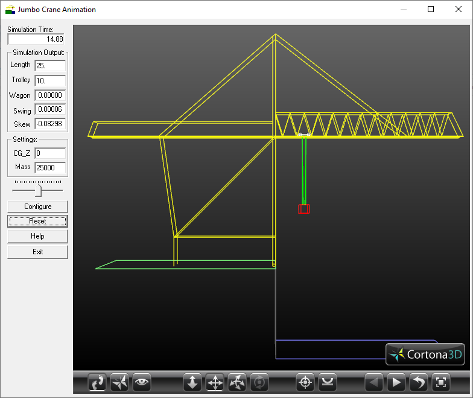

# Jumbo Container Crane VRML Simulator #

This project creates an interactive simulation of a Gantry Container Port Crane. Any Windows compatible game controller can be used to move the trolley on the crane and to lift the container.

This simulator was part of a research project:

- [Automatic Skew Control on Container Transhipment Cranes](https://doi.org/10.1016/S1474-6670(17)39272-8 "IFAC Paper"). G.E.Smid, J.B.Klaassens, H.R.van Nauta Lemke, A.El Azzouzi, R.van der Wekken. *IFAC Conference on Mechatronic Systems*, Darmstadt, Germany, 18-20 September 2000
Volume 33, Issue 26,
Pages 1-1129 (September 2000)
- [3D modeling visualization for studying controls of the jumbo container crane](https://ieeexplore.ieee.org/document/786141 "ACC 1999"). J.B. Klaassens, G. Honderd, A. El Azzouzi, Ka C. Cheok, G.E. Smid. Proceedings of the *1999 American Control Conference* (Cat. No. 99CH36251) ISBN: 0-7803-4990-3.

 

## Prerequisites ##

This project requires the [Cortona VRML plugin](http://www.cortona3d.com/en/cortona3d-viewer-download "Cortona plugin download") with the [Cortona SDK](http://download.cortona3d.com/238/edb2b7ad7a30b72d1c2ba364c161ea81/Cortona_SDK_41.zip "Cortona SDK 4.1"). 
It is built with Visual Studio 2017 with MFC extensions, and tested on Windows 10.

## User Guide ##

## Contact ##

For any further inqueries, contact Edzko Smid.